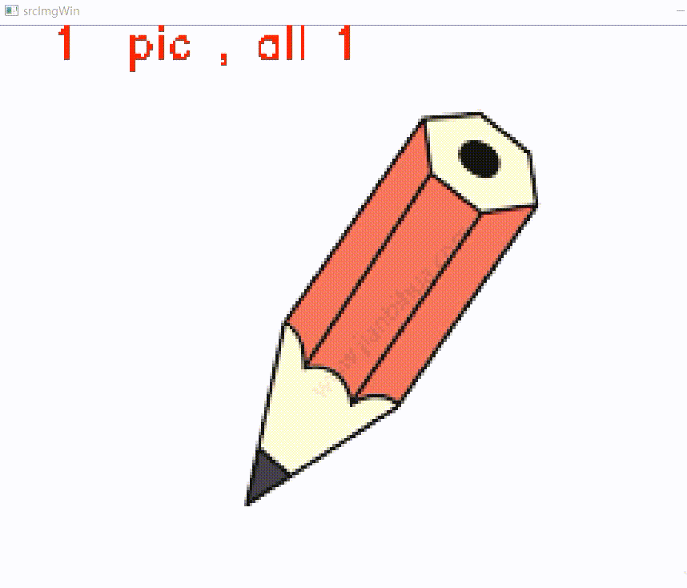

# labelRotRect
旋转矩形标注工具

仿照[Yolo-mark](https://github.com/AlexeyAB/Yolo_mark)输出格式编写的旋转矩形标注工具：  
生成数据格式[x, x, x, x, angle]

旋转矩形角度设置方式参考论文： [Arbitrary-Oriented Scene Text Detection via Rotation Proposal](https://arxiv.org/abs/1703.01086) , 该角度设计方式有利于神经网络的拟合。